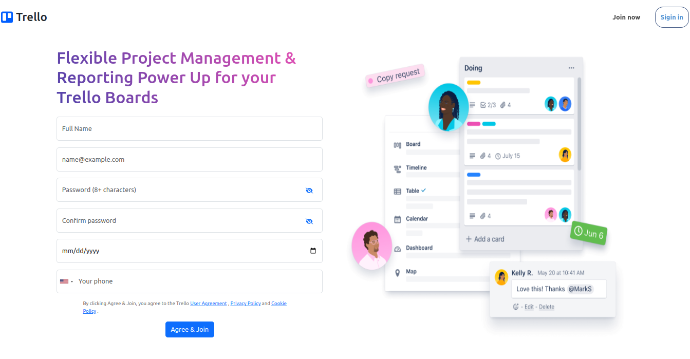
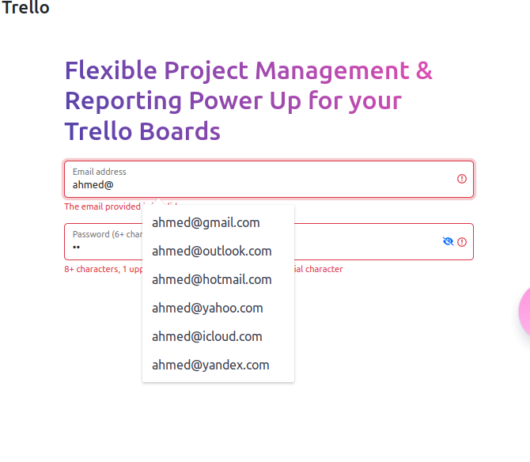
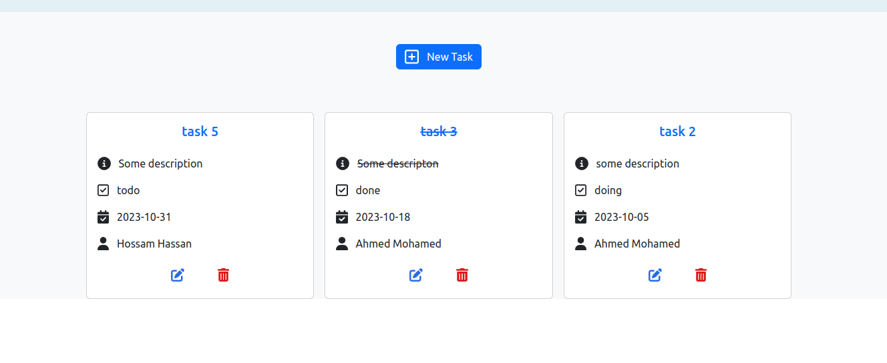
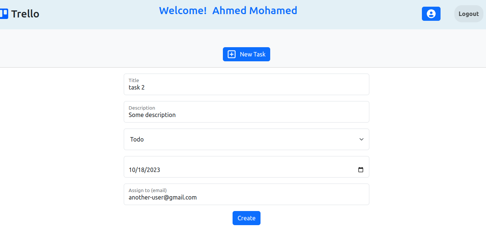
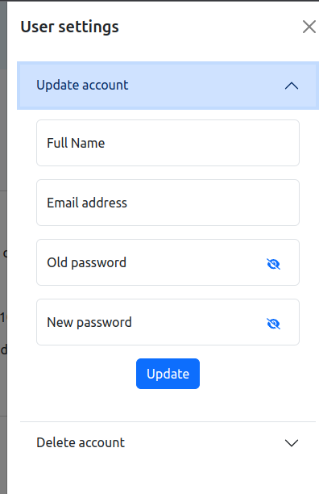
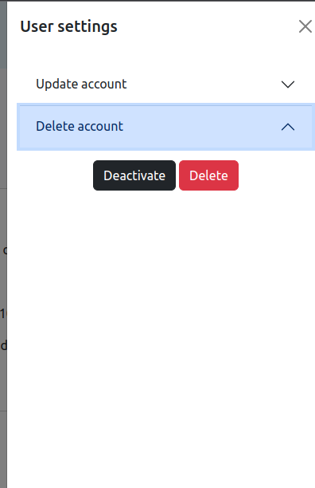

# Trello clone

A simplified clone project for a Trello application implemented as a full stack application(Frontend & backend)

## Taple of contents

- [Overview](#overview)
  - [The challenge](#the-challenge)
  - [Screenshot](#screenshot)
  - [Links](#links)
- [My process](#my-process)
  - [Built with](#built-with)
  - [What I learned](#what-i-learned)
  - [Continued development](#continued-development)
  - [Useful resources](#useful-resources)
- [Author](#author)

## Overview

### The challenge

Users should be able to:

- Install the website on his personal device (PWA)
- Create your own account.
- Receive a verification message via the email you entered.
- Log in to his personal account.
- Adding his own task with details, with the ability to assign it to another user.
- Edit task details.
- Delete the entire task.
- Modify his account information.
- Delete his account completely or partially (soft delete)
- sign out

### Screenshot

- 
- 
- 
- 
- 
- 

### Links

- [GitHub URL](https://github.com/mhmdnsr-dev/trello-app)
- [Live URL](https://trello-app-vblq.onrender.com/)

## My process

### Built with

#### Frontend

- HTML & CSS & Javascript.
- SASS
- jQuery library
- Bootstrap library
- Font Awesomelibrary

#### Backend

- express.js
- mongoose to handle monodb operations
- joi package for schema description language and data validator
- bcrypt package for hashing password
- CORS node.js package
- dotenv package for loads environment variables from a .env file
- jsonwebtoken: to create access token
- nodemailer module to allow email sending

### What I learned

- Dealing with nodejs environment
- Create a server from scratch
- Create a middleware express.js
- CRUD mongodb operations
- Send email messages with Nodemailer
- Deploy a web service app on render.com

### Continued development

- Improving the user experience by adding additional features

### Useful resources

- [Nodejs](https://nodejs.org/en/)
- [Mongoose](https://mongoosejs.com/)
- [Mongodb](https://www.mongodb.com/)
- [ExpressJs](https://expressjs.com/s)

## Author

- [LinkedIn](https://www.linkedin.com/in/mhmdnsr-dev/)
- [Twitter](https://twitter.com/mhmdnsr_dev)
